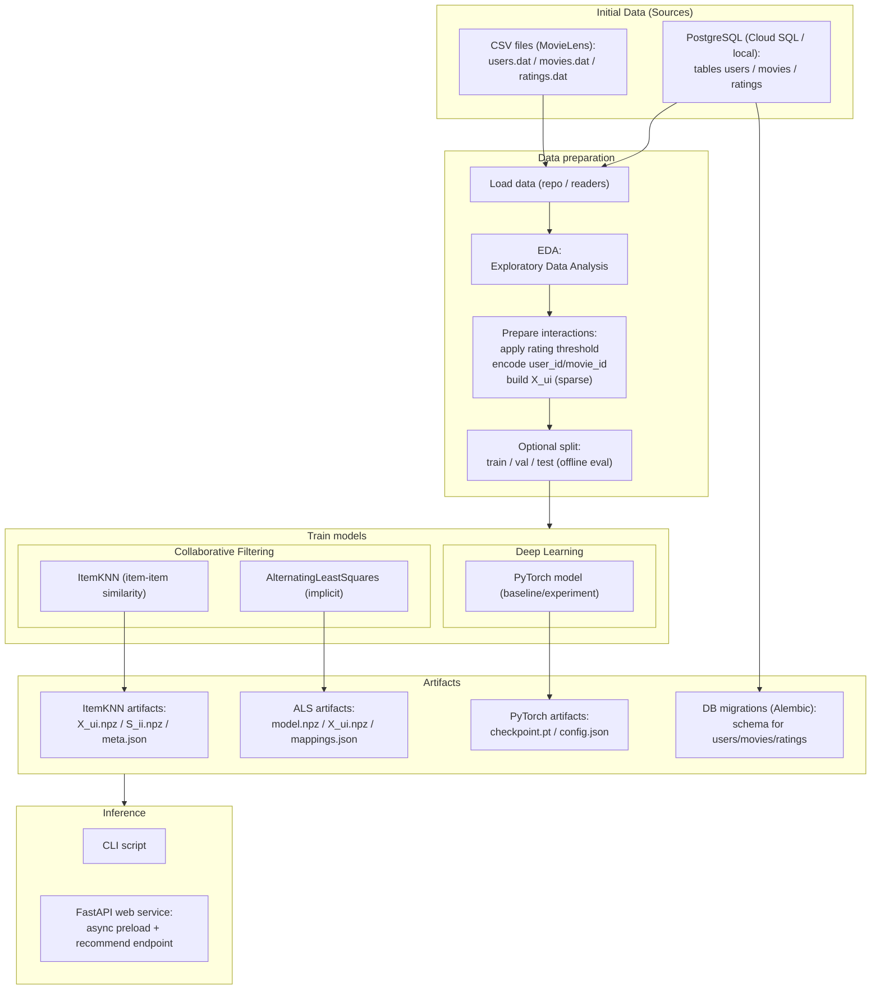

# 🎬 MovieLens Recommendation System

This project is capstone 2 assignment for [Machine Learning Zoomcamp 2025](https://datatalks.club/blog/machine-learning-zoomcamp.html)

## 🧩 Problem
Modern content platforms must help users discover relevant items from large catalogs. 

Without personalization, users face information overload, leading to poor engagement and satisfaction. 

This project addresses the problem of **personalized movie recommendations** based on user–item interaction data.

## 🎯 Objective
The objective is to build an **end-to-end recommendation system** that:
- Learns user preferences from historical ratings
- Produces personalized recommendations
- Exposes predictions via a REST API
- Is reproducible, containerized, and deployable to cloud infrastructure (GCP)

## 📊 Dataset
The project is based on the **MovieLens** dataset, which includes:
- Users
- Movies
- Explicit ratings (user → movie → rating)

Raw data is processed into intermediate Parquet files for efficient analytics and modeling.

## 📚 Theoretical background

### Useful links

* [Build a Recommendation Engine With Collaborative Filtering](https://realpython.com/build-recommendation-engine-collaborative-filtering/)

### What are recommender systems?

Recommender systems are a class of machine learning systems designed to **predict user preferences** and suggest relevant items from a large catalog. They are widely used in domains such as movies, music, e-commerce, news, and advertising.

Formally, the task can be described as estimating a function:

$$
\huge f(u, i) \rightarrow r
$$

where:
- $\large u$ is a user  
- $\large i$ is an item  
- $\large r$ is a relevance score (rating, probability of interaction, or ranking score)

The system then recommends the top-K items with the highest predicted relevance for each user.

---

### Types of recommender systems

#### 1. Content-based filtering

Content-based systems recommend items **similar to those the user liked in the past**, based on item attributes.

**How it works:**
- Build a user profile from item features (genres, tags, descriptions)
- Recommend items with similar features

**Pros:**
- No need for other users
- Works well for cold-start users (with some history)

**Cons:**
- Limited diversity
- Requires rich item metadata
- Cannot discover new tastes easily

---

#### 2. Collaborative filtering

Collaborative filtering relies on **user–item interaction patterns** rather than explicit item features.

The core assumption:

> Users who behaved similarly in the past will behave similarly in the future.

There are two main approaches:

---

##### a) Memory-based collaborative filtering

**User-based CF**
- Finds similar users
- Recommends items liked by neighbors

**Item-based CF**
- Finds similar items
- Recommends items similar to those the user interacted with

**Pros:**
- Simple and interpretable
- Effective for small to medium datasets

**Cons:**
- Poor scalability
- Sensitive to sparsity
- Expensive similarity computations

---

##### b) Model-based collaborative filtering

Model-based methods learn **latent representations** of users and items.

The most common approach is **Matrix Factorization**.

---

### Matrix Factorization

User–item interactions are represented as a matrix:

$$
\huge R ∈ ℝ^{|U| × |I|}
$$

Matrix factorization decomposes it into two low-rank matrices:

$$
\huge R \approx U \cdot Vᵀ
$$

where:
- $\large U$ represents user latent factors
- $\large V$ represents item latent factors

The dot product $u_i$ · $v_j$ gives a predicted relevance score.

---

### Alternating Least Squares (ALS)

ALS is a popular matrix factorization algorithm, especially for **large-scale recommendation systems**.

**Key idea:**
- Fix item factors $\rightarrow$ optimize user factors
- Fix user factors $\rightarrow$ optimize item factors
- Alternate until convergence

**Why ALS?**
- Efficient for sparse matrices
- Easy to parallelize
- Stable and scalable

**Variants:**
- Explicit feedback ALS (ratings)
- Implicit feedback ALS (views, clicks, purchases)

This project uses ALS as the **primary production model**.

---

### Item-based kNN

Item-based kNN is a memory-based collaborative filtering method.

**How it works:**
- Compute item–item similarity (cosine, dot product)
- Recommend items similar to those the user has interacted with

**Pros:**
- Simple baseline
- Easy to debug
- Fast inference

**Cons:**
- Does not generalize beyond observed interactions
- Limited performance compared to latent factor models

In this project, item-kNN is used as a **baseline model** for comparison.

---

### Implicit vs Explicit feedback

**Explicit feedback**
- Ratings (1–5 stars)
- Likes / dislikes

**Implicit feedback**
- Views
- Clicks
- Purchases
- Watch time

Implicit feedback is more common in production systems but noisier. ALS supports both modes.

---

### Key challenges in recommender systems

- **Data sparsity**: most users interact with very few items  
- **Cold start**: new users and new items  
- **Scalability**: millions of users and items  
- **Popularity bias**: over-recommending popular items  
- **Evaluation mismatch**: offline metrics ≠ online user satisfaction  

This project focuses on **scalable collaborative filtering**, suitable for production deployment, while keeping the architecture extensible for future improvements (hybrid models, online learning, exploration).

The system relies on classical recommender system techniques:
- **Collaborative Filtering**
- **Matrix Factorization**
- **Alternating Least Squares (ALS)** for implicit/explicit feedback
- **Item-based kNN** as a baseline

These approaches assume that users with similar historical behavior will have similar preferences in the future.

## 🧠 Project's diagram




## 🔍 EDA
Exploratory Data Analysis includes:
- Rating distributions
- User and item activity sparsity
- Long-tail effects
- Popularity bias
- Cold-start considerations

All EDA steps are documented in Jupyter notebooks.

## 🧪 Model selection
Implemented and compared models:
- ALS (primary production model)
- Item-based kNN (baseline)

Model choice is driven by:
- Scalability
- Recommendation quality
- Training/inference trade-offs

## 📐 Evaluation metrics
Offline evaluation uses:
- Precision@K
- Recall@K
- MAP@K
- Coverage (optional)

Metrics are computed on held-out validation splits.

## 💻 Tech stack

### Web API


### Machine Learning


### Infrastructure


## 🗂️ Project structure

```
├── alembic.ini                                 <- Alembic configuration (migrations)
├── cloudbuild.yaml                             <- Cloud Build pipeline definition
├── data                                        <- Local data directory
│   └── interim                                 <- Intermediate / processed datasets for development
│       ├── movies.parquet.gzip                 <- Processed movie metadata
│       ├── ratings.parquet.gzip                <- Cleaned user–item ratings
│       └── users.parquet.gzip                  <- User-level features
├── docker-compose.yaml                         <- Local multi-container setup (API/DB/tools)
├── Dockerfile                                  <- Image definition for API (and optional ML targets)
├── gcp-service-account.json                    <- GCP service account credentials (local use)
├── infra                                       <- Infrastructure as code and deployment assets
│   ├── deploy                                  <- Deployment manifests and Terraform config
│   │   ├── k8s                                 <- Raw Kubernetes YAML manifests (reference / manual apply)
│   │   │   ├── configmap.yaml                  <- Runtime configuration for API (env vars)
│   │   │   ├── deployment.yaml                 <- Kubernetes Deployment for API
│   │   │   ├── migrate-job.yaml                <- One-off Kubernetes Job for DB migrations (Alembic)
│   │   │   ├── namespace.yaml                  <- Kubernetes namespace definition
│   │   │   ├── secrets.yaml                    <- Kubernetes Secret definitions (DB creds, connection name)
│   │   │   ├── service.yaml                    <- Kubernetes Service (LoadBalancer) for API
│   │   │   └── serviceaccount.yaml             <- Kubernetes ServiceAccount (Workload Identity binding)
│   │   └── terraform                           <- Terraform project for GCP + K8s resources
│   │       ├── apis.tf                         <- GCP APIs enablement
│   │       ├── artifact_registry.tf            <- Docker Artifact Registry
│   │       ├── cloudsql.tf                     <- Cloud SQL instance, databases, users
│   │       ├── gcs.tf                          <- GCS buckets for data and models
│   │       ├── gke.tf                          <- GKE cluster and node pools
│   │       ├── iam.tf                          <- IAM roles and bindings (Cloud SQL, GCS, etc.)
│   │       ├── k8s.tf                          <- Kubernetes resources applied via Terraform
│   │       ├── locals.tf                       <- Shared local variables and manifest maps
│   │       ├── outputs.tf                      <- Terraform outputs (IPs, names, connection strings)
│   │       ├── providers.tf                    <- Terraform providers configuration
│   │       ├── secrets.tf                      <- Secrets management (K8s/GCP secrets wiring)
│   │       ├── service_account.tf              <- GCP service accounts for Workload Identity
│   │       ├── terraform.tfstate               <- Terraform state (local)
│   │       ├── terraform.tfstate.backup        <- Terraform state backup
│   │       ├── terraform.tfvars                <- Environment-specific variables
│   │       ├── terraform.tfvars.example        <- Example variables file
│   │       ├── variables.tf                    <- Input variable definitions
│   │       └── versions.tf                     <- Provider and Terraform versions
│   └── pgadmin                                 <- Local pgAdmin helper assets
│       ├── init_pgadmin.sh                     <- pgAdmin initialization script
│       ├── pgpass                              <- Postgres password file for tooling (local)
│       └── servers.json                        <- pgAdmin server connections configuration
├── Makefile                                    <- Common automation commands
├── mypy.ini                                    <- Static typing configuration
├── notebooks                                   <- Research / exploration notebooks
│   ├── 01_etl.ipynb                            <- Data ingestion & preprocessing
│   ├── 02_eda.ipynb                            <- Exploratory data analysis
│   ├── 03_pytorch.ipynb                        <- Experimental modeling (PyTorch)
│   ├── 03_train.ipynb                          <- Model training workflow
│   └── metrics.py                              <- Offline evaluation utilities
├── pyproject.toml                              <- Python dependencies and tooling
├── README.md                                   <- Project documentation
├── recsys                                      <- Application and ML code
│   ├── aggregates.py                           <- Domain models / aggregates used across the app
│   ├── alembic                                 <- Alembic migration package
│   │   ├── env.py                              <- Alembic runtime configuration (online/offline migrations)
│   │   ├── README                              <- Notes on migrations setup
│   │   ├── script.py.mako                      <- Migration template
│   │   └── versions                            <- Migration revisions
│   │       ├── 987c10513f96_seed_movielens_ml_1m_data.py <- Seed migration for MovieLens data
│   │       └── de48eeb5924c_create_users_movies_ratings.py <- Initial schema migration
│   ├── api                                     <- FastAPI application layer
│   │   ├── app.py                              <- FastAPI app entrypoint (lifespan, routes)
│   │   └── config.py                           <- API settings (Pydantic)
│   ├── config.py                               <- Global configuration helpers/constants
│   ├── db                                      <- Database layer (SQLAlchemy)
│   │   ├── models.py                           <- ORM models (users/movies/ratings)
│   │   ├── repositories                        <- Query/repository layer
│   │   │   ├── movies.py                       <- Movies repository (read/query helpers)
│   │   │   └── ratings.py                      <- Ratings repository (read/query helpers)
│   │   └── session.py                          <- DB engine/session factory (async)
│   ├── gcp.py                                  <- Google Cloud Storage / GCP utilities
│   ├── modeling                                <- Recommender models and training/inference code
│   │   ├── als.py                              <- ALS model wrapper (implicit)
│   │   ├── dataset.py                          <- Dataset / interaction building utilities
│   │   ├── item_knn.py                         <- Item-based kNN model
│   │   ├── predict.py                          <- Inference helpers / CLI prediction
│   │   ├── protocols.py                        <- Shared model protocols/interfaces (typing)
│   │   ├── torch.py                            <- PyTorch model baseline/experiments
│   │   └── train.py                            <- Training entrypoint/workflow
│   ├── recommender.py                          <- High-level recommender interface (model selection)
│   └── utils.py                                <- Shared utilities (I/O, parsing, helpers)
└── uv.lock                                     <- Locked Python dependencies
```

## 🔌 API Contract

### GET /users/{id}/recommendations?k={k}

Top-K recommendations for a user

### Response

```json
{
  "movies": [
    {
      "id": 263,
      "title": "Ladybird Ladybird (1994)",
      "genre": "Drama"
    },
    {
      "id": 612,
      "title": "Pallbearer, The (1996)",
      "genre": "Comedy"
    },
    {
      "id": 1663,
      "title": "Stripes (1981)",
      "genre": "Comedy"
    },
  ]
}
```

## 🚀  Run

This section explains how to run the project in different environments: locally, via Docker, through the API, notebooks, or the CLI.

In order to run the project, it is necessary to install

* [Docker](https://www.docker.com/)
* [docker-compose](https://docs.docker.com/compose/)
* [uv](https://docs.astral.sh/uv/)
* [Make](https://www.gnu.org/software/make/)

---

### 🛠️ Makefile

The `Makefile` provides a single entry point for common project tasks such as:

- installing dependencies
- running the API locally
- building Docker images
- running linters and type checks
- triggering training or inference jobs

Using the Makefile helps keep workflows consistent and reproducible.


```makefile
install-kernel:
	uv run python -m ipykernel install --user --name=movielens-recsys --display-name="Recommendation system (MovieLens)"

mypy:
	uv run mypy recsys/

black:
	uv run black --check recsys/

black-fix:
	uv run black recsys/

ruff:
	uv run ruff check recsys/ --fix

lint:
	make mypy & make black-fix & make ruff

api:
	docker-compose up api

jupyter:
	docker-compose up jupyter

train-cli:
	uv run python -m recsys.modeling.train --model-type=$(model_type) --bucket-name=$(bucket_name)

predict-cli:
	uv run python -m recsys.modeling.predict $(user_id) --model-type=$(model_type) --bucket-name=$(bucket_name)
```

---

### 🌐 API

The recommender system is exposed via a **FastAPI** application.

#### Local

To run the API locally:

* `uv sync`
* Activate virtual environment via `source .venv/bin/activate`
* `python -m recsys.api.app --host 0.0.0.0 --port ${PORT:-8080}`

The API will be available at: 

* http://localhost:8080/docs

---

#### Docker

The API can also be run inside a Docker container: `make api`

This command:
- build the Docker image
- run the container with required environment variables
- expose port `8000`

This setup closely matches the production environment used in Kubernetes.

---

### 📓 Jupyter

Jupyter notebooks are used for exploration and experimentation.

#### Local

Run Jupyter locally to work with notebooks from the `notebooks/` directory.  
They cover:

- ETL
- exploratory data analysis
- model training
- evaluation and metrics

In order to run notebooks locally:

* `uv sync`
* Activate virtual environment via `source .venv/bin/activate`
* Create kernel via `make install-kernel`
* Select given kernel in Jupter Notebooks

---

#### Docker

Jupyter can also be launched in Docker for environment isolation and reproducibility, which is useful when sharing experiments or aligning with production dependencies.

It is possible to run Jupyer Notebooks with docker-compose: `make jupyter`

---

### 🖥️ CLI

CLI entry points are implemented under:

* `make train-cli` - trains particular model
* `make predict-cli` - returns list of recommendations for user with particular model

## ☁️ Deployment

Service `/docs` could be found [here](http://34.159.178.13/docs)

* It is required to have a [GCP service account](https://docs.cloud.google.com/iam/docs/service-account-overview) in the root of the application's folder
* For making it default auth account, use `gcloud auth application-default login`
  * Make sure, that service account has appropriate roles, like `Cloud Build Service Account`
* After that it is required to build Docker image for GCP structure:

```bash
gcloud builds submit . --config cloudbuild.yaml
```

Then, the deployment itself:

1. Go in `infra/deploy/terraform`
2. `terraform init`
3. (rename `terraform.tfvars.example` => `terraform.tfvars`)
4. `terraform plan -var="apply_k8s=false" -var="apply_migrations=false"` - for creating the infrastructure itself, without applying Kubernetes configs
5. `terraform plan -var="apply_k8s=true" -var="apply_migrations=true"` - Apply Kubernetes configs (with migrations)
6. `terraform output service_external_ip` - You should be able to see external API, which can be used to application's access